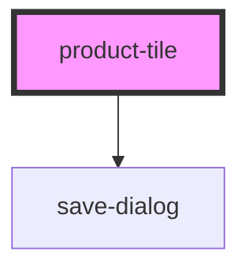

# product-tile

<!-- Auto Generated Below -->

## Properties

| Property       | Attribute        | Description | Type     | Default     |
| -------------- | ---------------- | ----------- | -------- | ----------- |
| `imageSrc`     | `image-src`      |             | `string` | `undefined` |
| `lists`        | `lists`          |             | `string` | `undefined` |
| `price`        | `price`          |             | `string` | `undefined` |
| `pricePerUnit` | `price-per-unit` |             | `string` | `undefined` |
| `productId`    | `product-id`     |             | `string` | `undefined` |
| `productName`  | `product-name`   |             | `string` | `undefined` |

## Events

| Event             | Description | Type               |
| ----------------- | ----------- | ------------------ |
| `addList`         |             | `CustomEvent<any>` |
| `toggleSelection` |             | `CustomEvent<any>` |

## Dependencies

### Depends on

- [save-dialog](../save-dialog)

### Graph

----------------------------------------------

*Built with [StencilJS](https://stenciljs.com/)*
