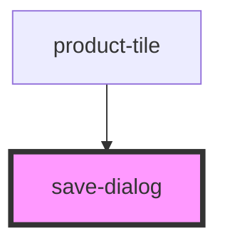

# save-dialog

<!-- Auto Generated Below -->

## Properties

| Property    | Attribute    | Description | Type                 | Default     |
| ----------- | ------------ | ----------- | -------------------- | ----------- |
| `lists`     | --           |             | `checkboxListItem[]` | `undefined` |
| `productId` | `product-id` |             | `string`             | `undefined` |

## Events

| Event    | Description | Type                  |
| -------- | ----------- | --------------------- |
| `close`  |             | `CustomEvent<any>`    |
| `create` |             | `CustomEvent<string>` |
| `toggle` |             | `CustomEvent<number>` |

## Dependencies

### Used by

 - [product-tile](../product-tile)

### Graph

----------------------------------------------

*Built with [StencilJS](https://stenciljs.com/)*
